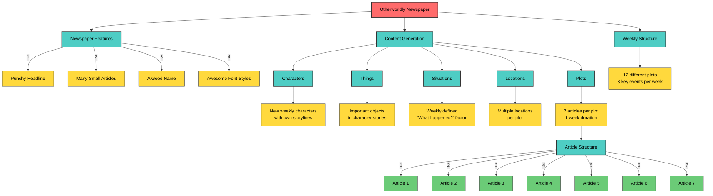
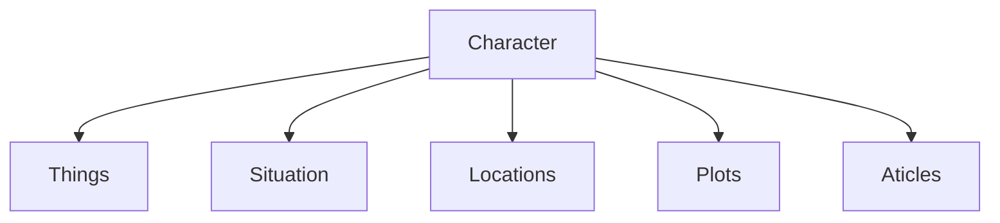
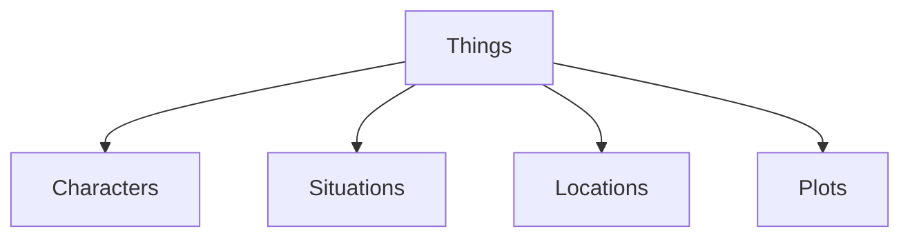
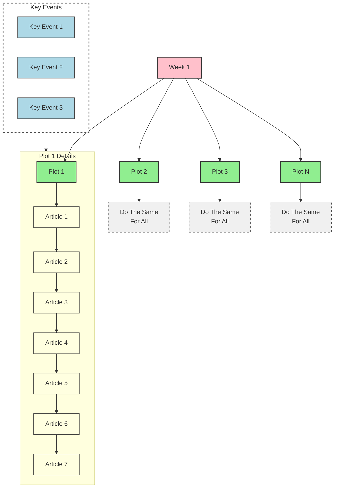

# Kagaz

*Midnight ledger / The Moons Gazette*

So, I have been getting this Idea since long that “ What If I make a newspaper that gives news of some other world”. And thats how we are here today.

## It needs a:

- Punchy Headline
- Many Small articles
- A Good Name
- Awesome font styles

## From AI end it needs:

- Characters
- Things
- Situations
- Locations
- Plot
- Articles



## Characters:

- Hmm lemme think each week there are new characters that are made.
- Each characters will have there own story lines.
- Each characters will have there own situations they will fall into.
- And Each character will have a end of week conclusion.



## Things:

- So each character will have multiple things that will be in there story.
- Things can be stuff like *(A missing shoe, a yellow umbrella, A knife used for stabbing, A lost bicycle)*
- Why are they important?
    
    *“**Objects help the writer develop the narrative and are often essential to the story**. A storyteller can tell about magical objects, such as a wand. They can also introduce into the story a map, from which the whole narrative starts, a gun or a watch. Many stories have started with a simple object.”*
    



## Situations:

- Hmm more like headlines I guess the *(What happened to Jeff?)* factor.
- Situations will be the outline of plots or like the topic of plots.
- Will be defined weekly.
- Situations will also define - Outlines, Plots, Characters, Things.

## Plots:

- So Plots hmmm ….. PLOTS PLOTS PLOTS. According to me plots will be generated using the the context of situations.
- Each plot will follow the basics of story it will start with a topic and end at a conclusion in the end of the week
- Each Plot will be 1 week long or will have 7 key stories.
- There will be a total of 12 different plots and each plot will have 7 parts or 7 articles.
- In the end of the each week the architecture will generate 3 diff keys points and a random topic will be selected so that we will never know what will happen next.
- Ok here is what I am thinking:




## Location:

- Each Location will be a part of a plot .
- Each Plot will have Multiple Locations.
- Each Location will have a significance.

## Articles:

- All Articles will be based on a plot.
- A plot will have 7 articles.
- Each article will have 5 key events
- each article will be related to one another for every plot
- Each Key Event will be randomly selected from a option of 3

# LLM Ka Hissa:

## The Basic Generate Function:

```python
from groq import Groq

client = Groq()
completion = client.chat.completions.create(
    model="llama3-8b-8192",
    messages=[
        {
            "role": "user",
            "content": ""
        }
    ],
    temperature=1,
    max_tokens=1024,
    top_p=1,
    stream=True,
    stop=None,
)

for chunk in completion:
    print(chunk.choices[0].delta.content or "", end="")

```

Basically This Function Will Be Modified and used to make all other generation functions.
